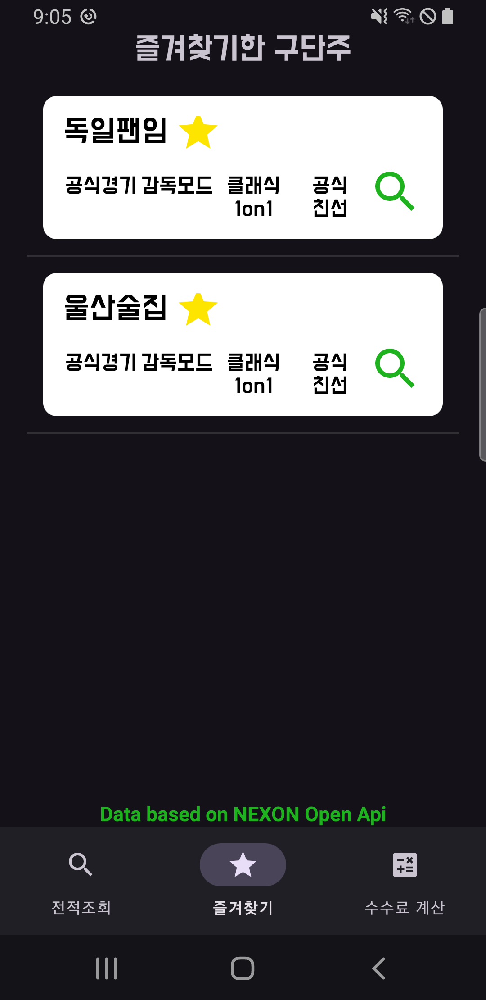
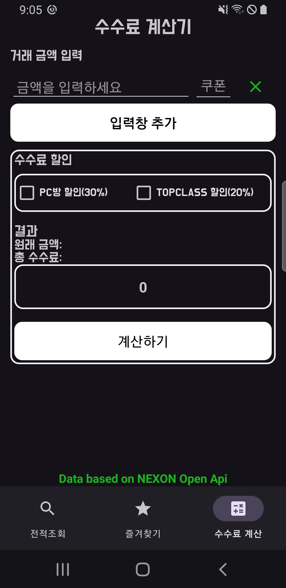

# FO4-Helper

## 프로젝트를 진행 하게된 계기
저는 항상 제 관심사에 맞는 프로젝트를 해보고 싶다는 생각을 가지고 있었습니다. 그래서 날씨 어플리케이션 프로젝트를 마친 후, 새로운 API를 활용한 프로젝트 주제를 고민하던 중, 우연히 넥슨에서 제공하는 **FC ONLINE**의 **OpenAPI**를 발견하게 되었습니다. 평소에 자주 즐기던 게임이기도 해서, 바로 **'이거다!'** 싶은 생각이 들었습니다.

실제로 경기 후 경기 전적과 기록을 확인하려면 FC ONLINE의 공식 모바일 앱에 접속해야 했는데, 그 과정이 너무 불편하다는 느낌을 받았었습니다. 그래서 **더 간편하고 빠르게 경기 기록을 조회할 수 있는 앱**을 만들면 좋겠다고 생각했고, 그 아이디어로 이 프로젝트를 시작하게 되었습니다.

## 설명
넥슨에서 제공하는 **FC ONLINE** 오픈 **API**를 활용하여 유저들의 **경기 전적**, 경기에서 사용한 **선수** 및 **포메이션**, 그리고 **경기의 상세 기록**을 확인할 수 있는 애플리케이션입니다.   또한, **수수료 계산기** 기능을 통해 선수거래 시 발생하는 수수료를 쉽게 계산할 수 있습니다.
   

## 기능

- **FC ONLINE4** 오픈 **API**를 활용하여 유저의 **경기 전적**, **선수**, **포메이션** 및 **상세 기록**을 실시간으로 확인.
- **수수료 계산기** 기능을 통해 선수 거래 시 발생하는 수수료를 쉽게 계산.
- 직관적이고 간단한 사용자 인터페이스로 유저 경험을 개선.
- 유저가 선택한 경기 기록 및 선수 정보를 빠르고 정확하게 조회할 수 있는 기능.

   
## 기술 스택

- **언어 (Languages)**: Java, XML
- **도구 (Tools)**: Android Studio
- **라이브러리 (Libraries)**: Android SDK, Glide, Retrofit, Room
- **기술 적용**:
  - **Retrofit**: **넥슨 FCONLINE4 오픈 API**와의 통신을 통해 유저의 경기 전적 및 상세 기록 조회.
  - **Glide**: 이미지 로딩 및 표시 최적화, 사용자 프로필 이미지 등 관리.
  - **Room**: 로컬 데이터베이스 사용, 유저의 즐겨찾기 선수 및 경기 기록 저장.
  - **RecyclerView**: 유연하고 효율적인 리스트 구현, 명언 및 경기 기록 표시.

   

## 개발 중 겪은 문제와 그 해결 과정
앱을 개발하던 중, **Room 데이터베이스**에서 데이터를 메인 스레드에서 직접 불러오려고 시도했을 때 앱이 강제 종료되는 현상이 발생했습니다. 이는 안드로이드에서 **메인 스레드에서 데이터베이스 작업을 처리할 수 없다는 제약** 때문에 발생한 문제였습니다.

### 문제 원인
메인 스레드에서 Room DB에 접근하려고 했기 때문에 **UI 스레드가 블로킹**되어 앱이 크래시가 발생한 것입니다. 안드로이드에서는 UI 스레드에서 시간이 오래 걸리는 작업을 하면 앱이 응답하지 않게 되므로, 데이터베이스 작업은 항상 **백그라운드 스레드**에서 처리해야 한다는 점을 간과한 것이었습니다.

## 해결과정
이 문제를 해결하기 위해, 데이터베이스 작업을 **별도의 스레드**에서 처리하도록 변경했습니다. 이를 위해 **Executor**를 사용해 별도의 스레드를 만들고, Room DB에 데이터를 요청했습니다. 이후 **UI 업데이트는 메인 스레드에서** 처리하도록 했습니다. 이를 위해 runOnUiThread() 메서드를 사용해 UI 업데이트를 메인 스레드에서 안전하게 처리할 수 있도록 했습니다.

또한, 체크박스 클릭 시 **즐겨찾기 데이터**를 **추가하거나 삭제하는 로직**에서도, 백그라운드 스레드를 사용하여 데이터베이스 작업을 처리했습니다. 이로써 **UI 스레드의 블로킹을 방지**하고 앱이 정상적으로 동작하게 되었습니다.

## 결과
이 방식으로 백그라운드 스레드를 활용해 데이터베이스 작업을 안전하게 처리하고, UI 업데이트는 메인 스레드에서 처리함으로써 앱이 정상적으로 작동하게 되었습니다. 이 과정에서 **스레드 처리**와 **Room 데이터베이스 연동 방식**에 대한 깊은 이해를 얻을 수 있었습니다.

   
  
## Screenshots

### 경기 전적 검색

- **공식경기**, **감독모드**, **클래식 1on1**, **공식친선** 등 다양한 경기 모드를 선택하여, 각 모드에 맞는 **경기 전적**을 확인할 수 있습니다.  

- 전적검색 실행화면
   
   
   

### 즐겨찾기 기능

- **즐겨찾기 기능**을 통해 자주 찾는 유저의 경기 전적을 빠르게 확인할 수 있습니다.  

- 즐겨찾기 기능 실행화면

 
 
 

### 수수료 계산기
**수수료 계산기** 기능을 통해 선수를 판매한 후 실제로 받을 수 있는 금액을 미리 계산할 수 있습니다.
기본적으로 **40%** 의 수수료가 부과되지만, **수수료 쿠폰**을 사용하면 10%에서 최대 40%까지 수수료를 할인받을 수 있습니다.
또한, **PC방** 이용 시 **30%**, **TopClass**라는 유료 아이템 구매 시 **20%** 의 수수료 할인이 제공됩니다. 이 계산기를 통해 다양한 조건을 고려해 판매 금액을 더 많이 받을 수 있는 방법을 확인할 수 있습니다.  

- 각 입력금액에 각각의 수수료쿠폰이 사용가능합니다.
- pc방 할인 및 topClass할인 선택이 가능합니다    

- 수수료 계산기 실행화면

