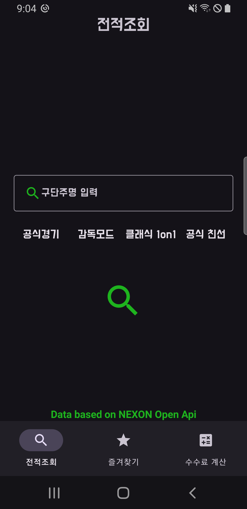

# FO4-Helper

## 설명
넥슨에서 제공하는 **FC ONLINE** 오픈 **API**를 활용하여 유저들의 **경기 전적**, 경기에서 사용한 **선수** 및 **포메이션**, 그리고 **경기의 상세 기록**을 확인할 수 있는 애플리케이션입니다.   또한, **수수료 계산기** 기능을 통해 선수거래 시 발생하는 수수료를 쉽게 계산할 수 있습니다.
   

## 기능

- **FCONLINE4** 오픈 **API**를 활용하여 유저의 **경기 전적**, **선수**, **포메이션** 및 **상세 기록**을 실시간으로 확인.
- **수수료 계산기** 기능을 통해 선수 거래 시 발생하는 수수료를 쉽게 계산.
- 직관적이고 간단한 사용자 인터페이스로 유저 경험을 개선.
- 유저가 선택한 경기 기록 및 선수 정보를 빠르고 정확하게 조회할 수 있는 기능.

   
## 기술 스택

- **언어 (Languages)**: Java, XML
- **도구 (Tools)**: Android Studio
- **라이브러리 (Libraries)**: Android SDK, Glide, Retrofit, Room
- **기술 적용**:
  - **Retrofit**: **넥슨 FCONLINE4 오픈 API**와의 통신을 통해 유저의 경기 전적 및 상세 기록 조회.
  - **Glide**: 이미지 로딩 및 표시 최적화, 사용자 프로필 이미지 등 관리.
  - **Room**: 로컬 데이터베이스 사용, 유저의 즐겨찾기 선수 및 경기 기록 저장.
  - **RecyclerView**: 유연하고 효율적인 리스트 구현, 명언 및 경기 기록 표시.

   

## 개발 중 겪은 문제와 그 해결 과정
앱을 개발하던 중, **Room 데이터베이스**에서 데이터를 메인 스레드에서 직접 불러오려고 시도했을 때 앱이 강제 종료되는 현상이 발생했습니다. 이는 안드로이드에서 **메인 스레드에서 데이터베이스 작업을 처리할 수 없다는 제약** 때문에 발생한 문제였습니다.

### 문제 원인
메인 스레드에서 Room DB에 접근하려고 했기 때문에 **UI 스레드가 블로킹**되어 앱이 크래시가 발생한 것입니다. 안드로이드에서는 UI 스레드에서 시간이 오래 걸리는 작업을 하면 앱이 응답하지 않게 되므로, 데이터베이스 작업은 항상 **백그라운드 스레드**에서 처리해야 한다는 점을 간과한 것이었습니다.

## 해결과정
이 문제를 해결하기 위해, 데이터베이스 작업을 **별도의 스레드**에서 처리하도록 변경했습니다. 이를 위해 **Executor**를 사용해 별도의 스레드를 만들고, Room DB에 데이터를 요청했습니다. 이후 **UI 업데이트는 메인 스레드에서** 처리하도록 했습니다. 이를 위해 runOnUiThread() 메서드를 사용해 UI 업데이트를 메인 스레드에서 안전하게 처리할 수 있도록 했습니다.

또한, 체크박스 클릭 시 **즐겨찾기 데이터**를 **추가하거나 삭제하는 로직**에서도, 백그라운드 스레드를 사용하여 데이터베이스 작업을 처리했습니다. 이로써 **UI 스레드의 블로킹을 방지**하고 앱이 정상적으로 동작하게 되었습니다.

## 결과
이 방식으로 백그라운드 스레드를 활용해 데이터베이스 작업을 안전하게 처리하고, UI 업데이트는 메인 스레드에서 처리함으로써 앱이 정상적으로 작동하게 되었습니다. 이 과정에서 **스레드 처리**와 **Room 데이터베이스 연동 방식**에 대한 깊은 이해를 얻을 수 있었습니다.

   
  
## Screenshots

### 경기 전적 검색

- **공식경기**, **감독모드**, **쿨래식 1on1**, **공식친선** 등 다양한 경기 모드를 선택하여, 각 모드에 맞는 **경기 전적**을 확인할 수 있습니다.

  

### Home Screen

- 앱 실행 시 보이는 홈 화면.  
- 세 가지 카테고리(**Success**, **Life**, **Motivation**) 중 하나를 선택할 수 있습니다.

### Quote Categories

- 선택한 카테고리에 따라 명언이 표시됩니다.  
- 예: **Success** 카테고리를 선택한 경우.

### Add Quote

- 카테고리를 롱 클릭하면 dialog가 출력됩니다.  
- 새로운 명언을 입력하고 추가 버튼을 클릭하면 데이터베이스에 추가됩니다.

### Delete Quote

- 오른쪽 상단의 아이콘을 클릭하면 옵션메뉴가 열립니다.
- 목록을 선택하면 각 카테고리별로 저장된 명언들이 새로운 액티비티에 출력됩니다.

  

- 각 명언 항목들을 길게 클릭하면 삭제됩니다.

## 실행 화면

- 페이드 인/아웃 애니메이션으로 부드럽게 명언이 전환 됩니다.
